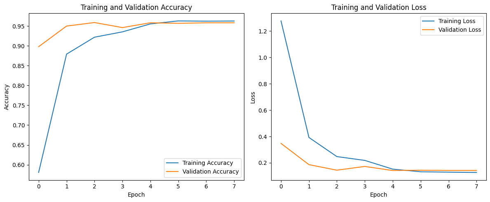
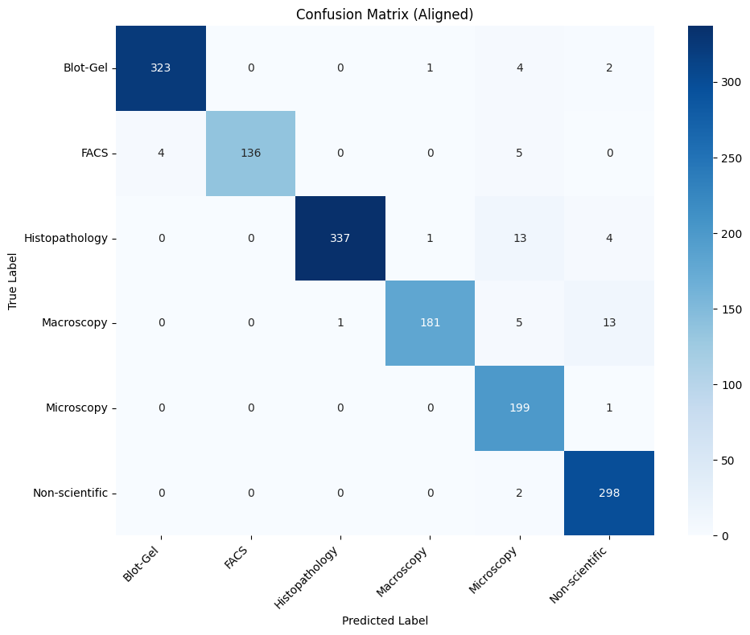

# Multi-Class Scientific Image Classification with Transfer Learning

[](https://opensource.org/licenses/Apache-2.0)

## Project Description

This project focuses on building, training, and evaluating a Convolutional Neural Network (CNN) model using Transfer Learning to classify scientific images into 6 distinct categories. The model utilizes the "Scientific Image Dataset" sourced from Kaggle.

The classification categories are:
1.  Blot-Gel
2.  FACS (Flow Cytometry)
3.  Histopathology
4.  Macroscopy
5.  Microscopy
6.  Non-scientific

The model leverages the MobileNetV2 architecture, pre-trained on the ImageNet dataset, as its base. Custom classification layers are added on top to tailor the model for this specific task. The accompanying Jupyter Notebook (`main.ipynb`) covers the entire workflow, including:

*   Exploratory Data Analysis (EDA)
*   Data Sampling (to balance classes with large numbers of images)
*   Data Preprocessing and Splitting
*   Data Augmentation (integrated into the model)
*   Model Building using Transfer Learning (MobileNetV2)
*   Model Training with Callbacks (ModelCheckpoint, EarlyStopping, ReduceLROnPlateau)
*   Model Evaluation (Accuracy, Classification Report, Confusion Matrix)
*   Model Saving in various formats (SavedModel, TF-Lite, TensorFlow.js)
*   Inference example on a test image.

## Technologies and Libraries Used

*   **Language:** Python 3.9+
*   **Deep Learning Framework:** TensorFlow 2.10+ (with Keras API)
*   **Data Manipulation & EDA:** NumPy, Matplotlib, Seaborn, Pillow (PIL), Pathlib
*   **Model Evaluation:** Scikit-learn
*   **Utilities:** OS, Random, shutil
*   **Web Deployment (Conversion):** TensorFlow JS
*   **Environment:** Jupyter Notebook / Lab (Recommended)

## Installation and Setup

1.  **Clone the Repository:**
    ```bash
    git clone https://github.com/maybeitsai/scientific-image-classification
    cd scientific-image-classification
    ```

2.  **Create a Virtual Environment (Recommended):**
    ```bash
    python -m venv venv

    # Activate on Windows
    .\venv\Scripts\activate

    # Activate on Linux/macOS
    source venv/bin/activate
    ```

3.  **Install Dependencies:**
    Ensure you have a `requirements.txt` file listing the necessary packages. If not, you can generate one from your working environment using `pip freeze > requirements.txt`.
    ```bash
    pip install -r requirements.txt
    ```

4.  **Set up Jupyter (If needed):**
    ```bash
    pip install jupyterlab
    jupyter lab
    ```

## Dataset

*   **Source:** [Scientific Image Dataset - Kaggle](https://www.kaggle.com/datasets/rushilprajapati/data-final)
*   **Original Directory Structure:** Download the dataset and place it within a `data/` directory at the project root, following this structure:
    ```
    data/
    ├── Blot-Gel/
    │   ├── image1.jpg
    │   └── ...
    ├── FACS/
    │   └── ...
    ├── Histopathology/
    │   └── ...
    ├── Macroscopy/
    │   └── ...
    ├── Microscopy/
    │   └── ...
    └── Non-scientific/
        └── ...
    ```
*   **Data Sampling:** The notebook includes a data sampling step for the `Histopathology`, `Macroscopy`, and `Non-scientific` classes, reducing them to `2000` samples each to create a more balanced dataset. This process generates a new directory named `data_sampled/` within the project containing the sampled data (and the full data for other classes). **Crucially, after this sampling step is executed, the `DATASET_DIR` variable in the notebook is updated to point to `data_sampled/` for all subsequent operations.**

## Usage

The primary workflow is contained within the `main.ipynb` Jupyter Notebook.

1.  **Launch Jupyter:** Open Jupyter Notebook or Jupyter Lab in your project directory.
2.  **Open Notebook:** Navigate to and open `main.ipynb`.
3.  **Execute Cells:** Run the notebook cells sequentially. The key steps are:
    *   **1. Setup & Import Libraries:** Loads necessary libraries and defines constants.
    *   **2. Exploratory Data Analysis (EDA):** Initial analysis on the original `data/` directory.
    *   **3. Data Sampling:** (Optional but performed by default in the notebook) Creates the `data_sampled/` directory. If you skip this, ensure `DATASET_DIR` points to the full `data/` directory.
    *   **4. Data Preprocessing & Splitting:** Loads data (from `data_sampled/` by default), splits into training (70%), validation (15%), and test (15%) sets using `tf.data.Dataset`.
    *   **5. Data Augmentation & Pipeline Optimization:** Configures data augmentation layers (integrated into the model) and optimizes the data pipeline using `cache()` and `prefetch()`.
    *   **6. Modeling (Transfer Learning):** Builds the CNN model using MobileNetV2 as the base, freezing its weights initially, and adding custom classification layers.
    *   **7. Callbacks:** Sets up callbacks for saving the best model, early stopping, and reducing the learning rate during training.
    *   **8. Model Training:** Trains the model using `model.fit()`. The best performing model based on validation accuracy is saved to `best_model_checkpoint.h5`.
    *   **9. Model Evaluation:** Evaluates the trained model on the test set using `model.evaluate()`. Generates and displays a classification report and a confusion matrix heatmap.
    *   **10. Model Saving:** Saves the trained model in various formats:
        *   TensorFlow SavedModel format in the `saved_model/` directory.
        *   TensorFlow Lite format in `tflite_model/model.tflite`.
        *   TensorFlow.js format in the `tfjs_model/` directory (requires `tensorflowjs` package).
    *   **11. Inference:** Demonstrates how to load the SavedModel and perform prediction on a single random image from the test set.

## Results and Performance

Based on the execution using the *sampled* dataset:

*   **Test Set Accuracy:** Approximately **96.34%** (obtained from `model.evaluate`).
*   **Training History Plots:** The notebook generates plots showing the training and validation accuracy and loss curves over epochs.
    
*   **Classification Report (Test Set):**
    ```
                    precision    recall  f1-score   support

          Blot-Gel       0.99      0.98      0.98       330
              FACS       1.00      0.94      0.97       145
    Histopathology       1.00      0.95      0.97       355
        Macroscopy       0.99      0.91      0.95       200
        Microscopy       0.87      0.99      0.93       200
    Non-scientific       0.94      0.99      0.96       300

          accuracy                           0.96      1530
         macro avg       0.96      0.96      0.96      1530
      weighted avg       0.97      0.96      0.96      1530
    ```
*   **Confusion Matrix (Test Set):**
    A heatmap visualization of the confusion matrix on the test set is generated by the notebook.
    

## Saved Model Formats

The trained model is saved in the following formats for different deployment scenarios:

*   **SavedModel:** `saved_model/` (Standard TensorFlow format, includes assets, variables, and the model graph). Recommended for TensorFlow Serving or further conversion.
*   **TensorFlow Lite:** `tflite_model/model.tflite` (Optimized format for mobile and edge devices).
*   **TensorFlow.js:** `tfjs_model/` (Format suitable for deploying the model in web browsers).

## License

This project is licensed under the Apache License 2.0. See the `LICENSE` file for more details.